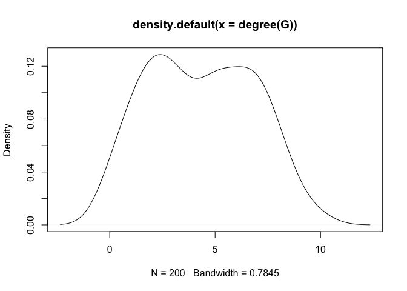
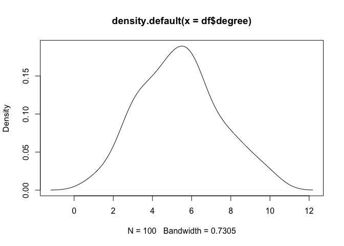

README
================

## GitHub Documents

This package is designed to generate full networks for ABMs from survey
data, sampled from the nodes of the network.  
For example, the survey asked people about their attributes (say,
ethnicity) and also asked them whom they friend with, what attributes
(ethnicity) their friends have, and how many such friends they each
have.  
Say, a paricipant could be white, have 4 white friends, 3 black friends
and 1 asian friend in his network.  
Then, this package could be used to generate a full network, based on
these ego network info, that represents  
1\. the attribute distribuion,  
2\. the degree distribution,  
3\. the attribute by degree distribution,  
4\. the attribute by degree by link type (e.g. black-white link,
asian-asian link) distribution,  
of the dataset.

## How to install

To install from GitHub, run this code

    devtools::install_github("haoqi1988/ExtrapolateNetwork")

## Input Preparation

The main input of the ExtrapolateNetwork() function in this package is
the empirical dataframe of ego network infomation. Here is a fake
dataset for demo purposes.

Note, the dataframe have to be prepared into the following structure  
1\. the first two variables have to be ‘attribute’ and ‘degree’  
2\. the number of friends with attribute ‘a’,‘b’,‘c’ etc are put after
the first two variables  
3\. no other variables in the dataframe  
4\. the values for ‘attribute’ must be the same as the variable names

``` r
# data on attributes of each participant
attribute <- sample(c('a','b','c'), 100, replace = T) 
# data on participants' number of friends who fall into an attribute
a <- sample(0:3, 100, replace = T) # number of friends with attribute 'a'
b <- sample(0:3, 100, replace = T) # number of friends with attribute 'b'
c <- sample(0:4, 100, replace = T) # number of friends with attribute 'c'
# etc... as many attributes as in the empirical data
# data on the degree of each participant
degree <- a + b + c
# so here is a fake dataset
df <- cbind.data.frame(attribute,degree, a, b, c)# note here the first two variables have to be attribute, degree
df$attribute <- as.character(df$attribute)
```

``` r
# now that we have generated a fake dataset,
head(df)
```

    ##   attribute degree a b c
    ## 1         c      7 2 3 2
    ## 2         b      8 2 3 3
    ## 3         c      4 3 1 0
    ## 4         b      7 3 2 2
    ## 5         b      7 3 1 3
    ## 6         c      1 1 0 0

``` r
# the dataframe have to be prepared in this above structure. You can have more attributes, under other names as long as they are consistent
```

``` r
# identify the number of possible values for the attributes
a <- 3
# specify desired number of agents in the output. here, the data has 100 participants, i want to build a network with 200 nodes for my agent-based model,
N <- 200
```

## Run the package

    ## $names
    ## [1] "AdjacencyMat" "AgentsDf"     "MisMatch"

    ## 
    ## Attaching package: 'igraph'

    ## The following objects are masked from 'package:stats':
    ## 
    ##     decompose, spectrum

    ## The following object is masked from 'package:base':
    ## 
    ##     union

    ## Warning in graph_from_adjacency_matrix(adjmatrix = results$AdjacencyMat, : Same
    ## attribute for columns and rows, row names are ignored

<!-- --><!-- -->
